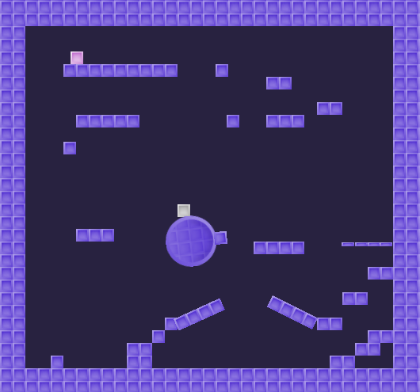

# Modular Kinematic Character 2D

This is an example of the Modular Character Controller within an official Godot Demo. The purpose of this project is to show that the controller works in 2D and how to adapt a script to the Modular Character Controller structure.

The project is largely the same and the original character is left for reference. Both the original and new players can be found in the "player" folder. The modular character is the one in the world scene. 
  

**Original Project:** 

[**Kinematic Character 2D**](https://godotengine.org/asset-library/asset/113)

